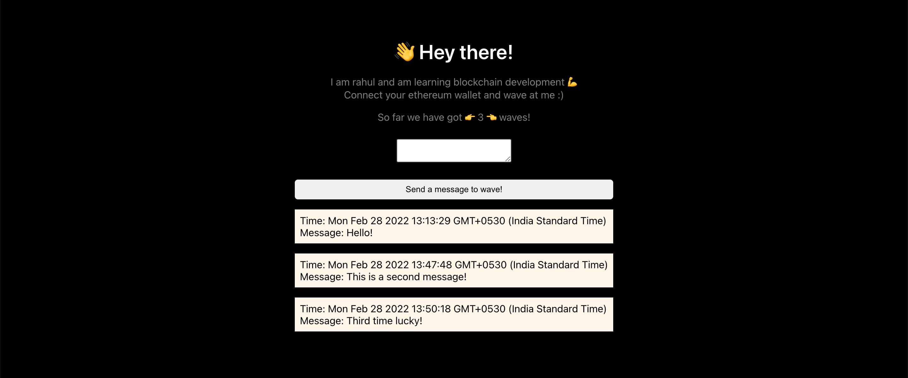

# Wave :tada: project using Hardhat and Alchemy
Project that uses [hardhat framework](https://hardhat.org/) built for easy ethereum deployment, [alchemy](alchemyapi.io) for easy deployment and nodejs for everything else.

The frontend uses repl.it for quick and easy react.js based UI deployment.



### run a quick blockchain test locally
```shell
npx hardhat run scripts/run.js --verbose
```

### deploy test locally
```shell
npx hardhat run scripts/deploy.js --verbose
```

### deploy over renkibey test network 
```shell
npx hardhat run scripts/deploy.js --network rinkeby
```

### Other helpful commands
```shell
npx hardhat accounts
npx hardhat help
```

### Important links
- [Renkibey Faucet](https://faucet.rinkeby.io/) for getting test ethereum im your `metamask` account
- [Etherscan](https://rinkeby.etherscan.io/) to verify any  transaction
